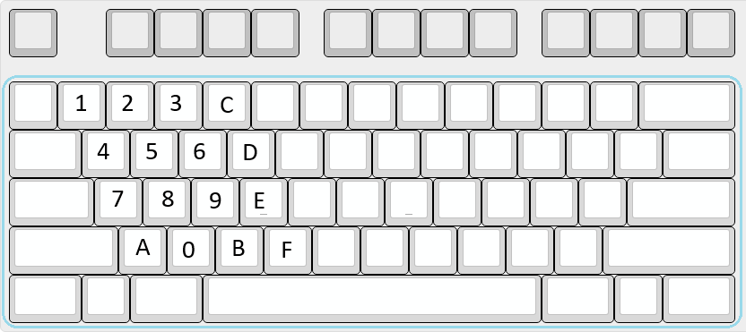
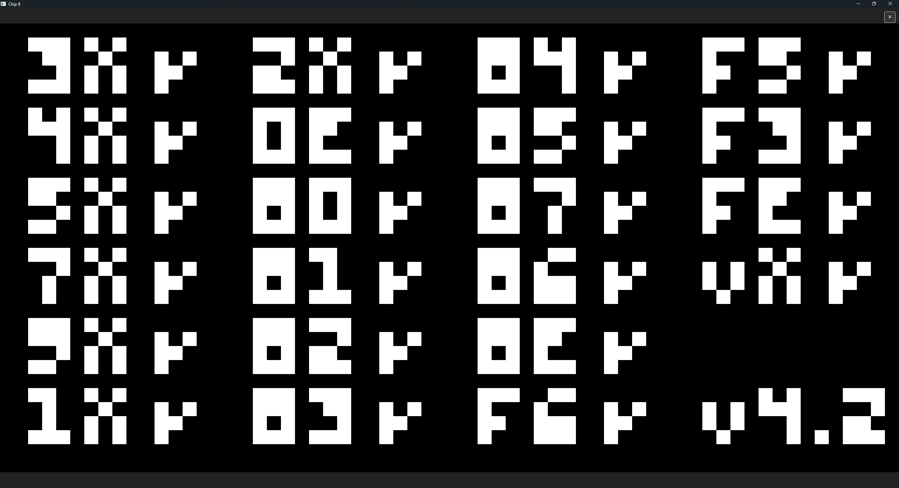
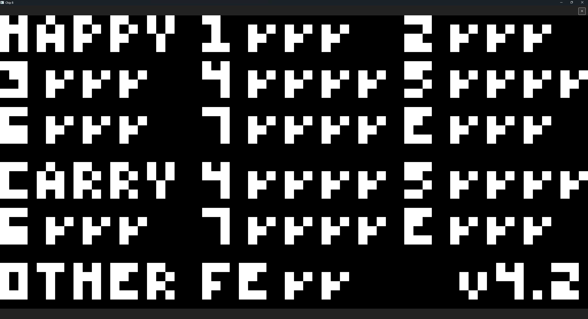
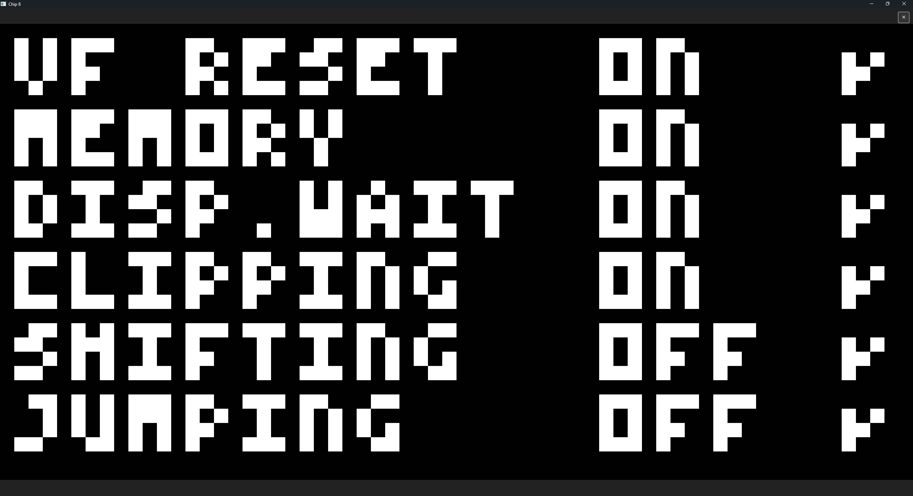
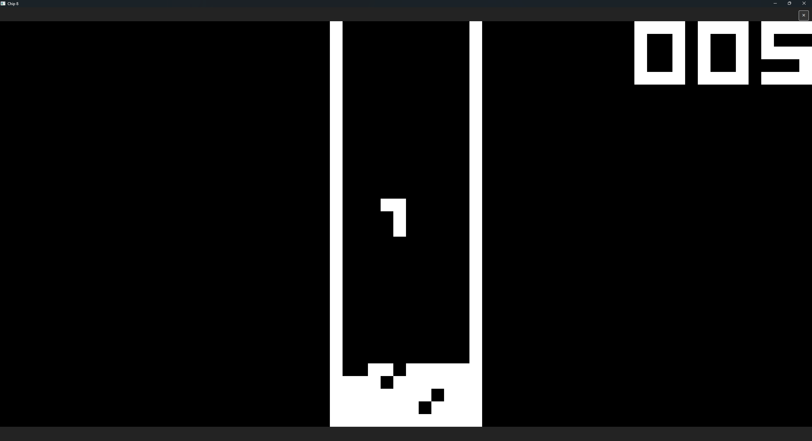

# Description

#### This is a simple CHIP-8 emulator written in C#. It features support for multiple keyboard layouts and 3 different versions of the CHIP-8 interpreter. I use the test ROMs from the [Timendus CHIP 8 test suite](https://github.com/Timendus/chip8-test-suite) to test and debug my emulator, I included screenshots from some of the tests.

>**NOTE:**
Some features like the sound, the XO-CHIP interpreter and the SCHIP interpreter do not work yet because this project is still a work in progress.

# How to run

1. first you need to install the dotnet sdk, look [here](https://dotnet.microsoft.com/en-us/download/dotnet/10.0) for instructions

2. clone the repo
```bash
$ git clone https://github.com/Die-Banane/Chip_8.git
```

3. navigate to the directory where the .csproj file is located
```bash
$ cd Chip_8/Chip_8
```

4. run the project
```bash
$ dotnet run
```

# Keymaps

This is the layout of the COSMAC VIP


on a modern keyboard the mapping looks like this



# Screenshots

### corax+ opcode test (Timendus test suite)


### flags test (Timendus test suite)


### quirks test (Timendus test suite)


### tetris
